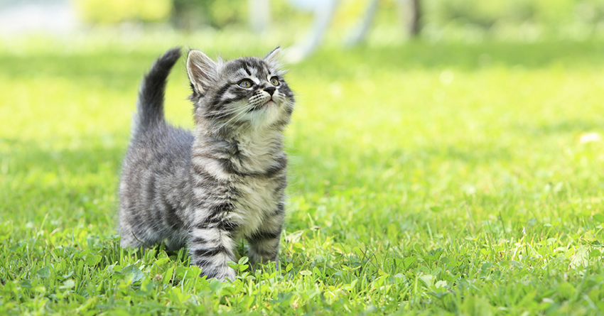

```{r setup, include=FALSE}
knitr::opts_chunk$set(echo = FALSE)
```

# Section slide | super stuff

# Section slide | with background image {data-background=bg_mountain.jpg data-background-size=cover}

## Slide with content

- I love science
- and **kitten!**

{ width=60% }

## Slide with R code

```{r, echo=TRUE}
fit <- lm(dist ~ 1 + speed, data = cars)
coef(summary(fit))
```

## Slide with R plot

```{r, echo=TRUE}
plot(dist ~ speed, data = cars)
```


## Slide with Bullets

- Bullet 1
- Bullet 2
- Bullet 3

## Slide with R Output

```{r cars, echo = TRUE}
summary(cars)
```

## Slide with Plot

```{r pressure}
plot(pressure)
```

