class: title-slide, middle


# Touchdown your research with </img>


.instructors[
  **QCBS R Workshop**

  Steve Vissault, Marie-Hélène Brice,
  David Beauchesne & Kevin Cazelles
]

<a href="https://insileco.github.io"></img></a>

<div style="color:white;">
.font60[Adapted from [Alison Hill](https://rmd4medicine.netlify.com/slides/01-rmd-anatomy.html#8)]
</div>

---

# Workshop setup

- Make sure you have an updated version of [RStudio](https://rstudio.com/products/rstudio/download/)
- Install the [code version-control system Git](https://git-scm.com/downloads)
- Create a [Github account](https://github.com/join?source=header-home)
- Run the following R command: 
```{r eval=FALSE} 
  install.packages(c("rmarkdown",
                      "htmlwidgets",
                      "bookdown",
                      "blogdown",
                      "DT",
                      "leaflet",
                      "rbokeh"))
```
- Be prepared to turn into a geek or just learn cool stuff 


---

class: clear, middle, center

```{r echo=FALSE, out.width="80%"}
knitr::include_graphics("assets/img/rmarkdown_rockstar.png")
```

.font80[Illustration from [@allisonhorst](https://twitter.com/allison_horst)]

---

class: clear, middle

## R Markdown universe

R Markdown produces dynamic document in a variety of format.

### Opens new possibilities with R:

* make CV, poster & online presentation
* format scientific paper (`rticles`)
* help to document your research through notebook (`bookdown`)
* build an academic blog or website (`blogdown`)

---

class: clear, middle

## But what's R Markdown?

- ["An authoring framework for data science."](https://rmarkdown.rstudio.com/lesson-1.html) (✔️)
- [A document format (.Rmd).](https://bookdown.org/yihui/rmarkdown/) (✔️)
- [An R package named rmarkdown.](https://rmarkdown.rstudio.com/docs/) (✔️)
- ["A tool for integrating text, code, and results."](https://r4ds.had.co.nz/communicate-intro.html) (✔️)
- ["A file format for making dynamic documents with R."](https://rmarkdown.rstudio.com/articles_intro.html) (✔️)
- ["A computational document."](http://radar.oreilly.com/2011/07/wolframs-computational-documen.html) (✔️)
- [Wizardry.](https://raw.githubusercontent.com/allisonhorst/stats-illustrations/master/rstats-artwork/rmarkdown_wizards.png) (🧙)


---

class: inverse, center, middle

# Workshop objective

<html><div style='float:left'></div><hr color='#ffdd55' style="margin-top:-60px" size=1px width=720px></html>

## Build a website | notebook | presentation with <code style="color:rgb(11, 43, 70)">rmarkdown</code> and deploys it on the web


---
class: inverse, center, middle

# Basic Anatomy

<html><div style='float:left'></div><hr color='#ffdd55' style="margin-top: -60px;" size=1px width=720px></html>

## R Markdown (`r icon::ii("social-markdown")` + `r icon::fa("r-project")`)

---

# `r icon::fa("gamepad")` Exercice

1. Open RStudio
2. File > New File > R Markdown
3. Fill the fields *author* and *title*
4. Set default output format to HTML
5. Look at the source, then 🧶 Knit to HTML.

### Try to identify these parts in the source and the output:

- The metadata
- The text `r icon::ii("social-markdown")`
- The code `r icon::fa("r-project")`
- The output

```{r, echo=FALSE}
countdown::countdown(minutes = 3, seconds = 0)
```

---


# How does R Markdown work?

.pull-left[
```{r echo=FALSE, out.width="100%"}
knitr::include_graphics("assets/img/Rmdformat.png")
```
]

.pull-right[
- 🤷
- I press knit, a document appears, and I believe that anything happening in between could be actual magic.
- `knitr` executes the code and converts `.Rmd` to `.md`; Pandoc renders the `.md` file to the output format you want.
]

---

class: middle, center, clear


.font80[Illustration from [@allisonhorst](https://twitter.com/allison_horst)]

---
class: inverse, center, middle

#  Document metadata

<html><div style='float:left'></div><hr color='#ffdd55' style="margin-top: -60px;" size=1px width=720px></html>

## R Markdown (`r icon::ii("social-markdown")` + `r icon::fa("r-project")`)

---

# Metadata and options

Metadata with options are defined in the header of the `.Rmd` document as a set of `key` and `value` (YAML syntax).

.pull-left[
### One output
```r
---
output: html_document
---
```
]

.pull-right[
### Two outputs
```r
---
output:
html_document:
    toc: true
  pdf_document:
    toc: false
---
```
]

Options available depend on the output.
See `?html_document `, `?pdf_document`, `?word_document`

???

- You have already notice the keys `author`, `title`, `date`
- What's the purpose of the indentation?

---

# `r icon::fa("gamepad")` Exercice

### Edit the output options

Use `?html_document` from your R console to:

1. Add a floating table of contents
2. Add a theme
3. Use the "kable" method to print data frames

🧶 Knit to HTML to see the output.

If this was easy, try to embed the Rmd source code to download.

```{r, echo=FALSE}
countdown::countdown(minutes = 3, seconds = 0)
```

???

### Answer

```r
---
output:
  html_document:
    toc: true
    toc_float: true
    theme: flatly
    df_print: kable
    code_download: true
---

We have done a brief overview of the document options (the shape), we now make an
introduction of the content

```

---
class: inverse, center, middle

#  Document content

<html><div style='float:left'></div><hr color='#ffdd55' style="margin-top: -60px;" size=1px width=720px></html>

## R Markdown (`r icon::ii("social-markdown")` + `r icon::fa("r-project")`)


---

class: clear, middle, center

```{r echo=FALSE, out.width="80%"}
knitr::include_graphics("assets/img/rmarkdown_rockstar.png")
```

.font80[Illustration from [@allisonhorst](https://twitter.com/allison_horst)]

---
class: inverse, center, middle

# Text formatting

<html><div style='float:left'></div><hr color='#ffdd55' style="margin-top: -60px;" size=1px width=720px></html>


## Markdown `r icon::ii("social-markdown")`

---

# Text style

.pull-left[
````md
# Header 1
## Header 2
### Header 3
#### Header 4

*italic* or _italic_
**bold**
`code`

`r ''`
```r
library(tibble)
data(iris)
glimpse(as_tibble(iris))
```
````

]
.pull-right[
<h1 style="margin:0px;padding:0px">Header 1</h1>
<h2 style="margin:0px;padding:0px">Header 2</h2>
<h3 style="margin:0px;padding:0px">Header 3</h3>
<h4 style="margin:0px;padding:0px">Header 4</h4>
*italic* or _italic_
**bold**
`code`
```r
library(tibble)
data(iris)
glimpse(as_tibble(iris))

```
]


???
Headers help you to structure your Rmd Document

---

# Lists

.pull-left[
```md
Lorem ipsum dolor sit amet,
consectetur
adipiscing elit.

- Cras convallis purus.
- Nunc faucibus.
- Maecenas ipsum dolor.

Nulla vehicula metus vel tortor
venenatis luctus.
Etiam tempus sit amet ligula
nec pretium. Aenean ultrices
massa sed pulvinar pulvinar.

1. Duis aliquam commodo volutpat.
1. Mauris ultrices.
1. Aliquam eu erat.
```
]

.pull-right[
Lorem ipsum dolor sit amet, consectetur adipiscing elit.

* Cras convallis purus.
- Nunc faucibus.
* Maecenas ipsum dolor.

Nulla vehicula metus vel tortor venenatis luctus.

1. Duis aliquam commodo volutpat.
1. Mauris ultrices.
1. Aliquam eu erat.
]


---

# Images

.pull-left[
```md

```
]

.pull-right[

]


---

# Links


.pull-left[
```md
[Hulk vs Trump](https://media.giphy.com/media/MkGyW2cOH7uhO/giphy.gif)

```
]

.pull-right[
[Hulk vs Trump](https://media.giphy.com/media/MkGyW2cOH7uhO/giphy.gif)

]


---

# Tables

.pull-left[

### Syntax


```md
| Time          | Session | Topic    |
|:--------------|:-------:|---------:|
| _left_        | _center_| _right_  |
| 01:00 - 01:50 | 1       | Anatomy  |
| 01:50 - 02:00 |         | *Break*  |
| 02:00 - 02:45 | 2       | Tables   |
| 02:45 - 03:00 |         | *Break*  |
```

]

.pull-right[

### Output


| Time          | Session | Topic    |
|:--------------|:-------:|---------:|
| _left_        | _center_| _right_  |
| 01:00 - 01:50 | 1       | Anatomy  |
| 01:50 - 02:00 |         | *Break*  |
| 02:00 - 02:45 | 2       | Tables   |
| 02:45 - 03:00 |         | *Break*  |

]


- `r icon::fa("exclamation-triangle")` the `:` specify the alignement.
- Not convenient for long table, we will use instead `r icon::fa("r-project")` to print the markdown table for us.


---
class: inverse, center, middle

#  Code chunks

<html><div style='float:left'></div><hr color='#ffdd55'style="margin-top: -60px;" size=1px width=720px></html>

## The `r icon::fa("r-project")`  part

---

# Chunks

```{r include=FALSE}
knitr::opts_chunk$set(eval=FALSE)
```


````md
This text is written in markdown

```{r}`r ''`
library(tibble)
data(iris)
head(iris)
```
````

- `r icon::fa("exclamation-triangle")` `r` between brackets `{}`, why is that?
- Where is the `r icon::fa("r-project")` code and the `r icon::ii("social-markdown")` section?


---

# Chunks

### Code

```{r}
library(tibble)
data(iris)
head(iris)
```

### Print output

```{r echo = FALSE, eval = TRUE}
library(tibble)
data(iris)
head(iris)
```


---

# Chunks
.pull-left[

### Code

```{r}
library(ggplot2)
data(iris)
ggplot(
      data=iris,
      aes(x = Sepal.Length,
          y = Sepal.Width)
  ) +
geom_point(
  aes(color=Species, shape=Species)
) +
xlab("Sepal Length") +
ylab("Sepal Width") +
ggtitle("Sepal Length-Width")
```
]

.pull-right[
### Graphic output

```{r echo = FALSE, eval = TRUE, dpi=300, fig.height=5, fig.width=5}
library(ggplot2)
data(iris)
ggplot(
      data=iris,
      aes(x = Sepal.Length,
          y = Sepal.Width)
  ) +
  geom_point(aes(color=Species, shape=Species)) +
  xlab("Sepal Length") +  ylab("Sepal Width") +
  ggtitle("Sepal Length-Width")
```
]

---

# Chunks

.pull-left[
### Code

```{r}
library(leaflet)
leaflet(height=400, width=400) %>%
  addTiles() %>%
  addMarkers(lng=174.768, lat=-36.852,
             popup="The birthplace of R")
```
]

.pull-right[
<h3 style="margin-bottom:10px;">Map</h3>

```{r echo = FALSE, eval = TRUE, dpi=300}
library(leaflet)
leaflet(height=400, width=400) %>%
  addTiles() %>%
  addMarkers(lng=174.768, lat=-36.852,
             popup="The birthplace of R")
```
]


---

# Chunks

.pull-left[
### Code

```{r}
library(rbokeh)
p <- figure() %>%
  ly_points(Sepal.Length, Sepal.Width,
    data = iris,
    color = Species, glyph = Species,
    hover = list(Sepal.Length, Sepal.Width))
p
```
]

.pull-right[
<h3 style="margin-bottom:10px;">Map</h3>

```{r echo = FALSE, eval = TRUE, warning=FALSE, dpi = 300}
library(rbokeh)
p <- figure(width = 400, height = 400)  %>%
  ly_points(Sepal.Length, Sepal.Width, data = iris,
    color = Species, glyph = Species,
    hover = list(Sepal.Length, Sepal.Width))
p
```
]

```{r include=FALSE, eval = TRUE}
knitr::opts_chunk$set(eval=TRUE)
```

---

# Inline chunks

### `r icon::fa("code")` Syntax

We studied `` `r
length(levels(iris$Species))` `` iris species and took
measurements on `` `r
nrow(iris)` `` flowers.

We found that Iris virginica had the longest sepal with a mean of
`` `r
mean(subset(iris,Species=="virginica")$Sepal.Length)`
`` millimeters!

### `r icon::fa("file-alt")` Output

````md
This text is written in markdown.

We studied `r length(levels(iris$Species))` iris species and took measurements on `r nrow(iris)` flowers.

We found that Iris virginica had the longest sepal with a mean of `r mean(iris$Sepal.Length[iris$Species=="virginica"])` millimeters!
````


---
class: inverse, center, middle

# `r icon::fa("rocket")` Chunks options

<html><div style='float:left'></div><hr color='#ffdd55' style="margin-top: -60px;" size=1px width=720px></html>

---

# Chunks options


.pull-left[
- Place between curly braces
  `{r option=value}`

- Multiple options separated by commas
  `{r option1=value, option2=value}`

- Label your code chunk!
</img>

]


.pull-right[

````md
```{r dispIris, option1=value, option2=value}`r ''`
library(tibble)
data(iris)
head(iris)
```
````
]


---

# Chunk options

Chunk output can be customised with [numerous options](https://yihui.name/knitr/options/):

```{r}
str(knitr::opts_chunk$get())
```

---

# Default options

.pull-left[

### `r icon::fa("code")` Syntax

````md
```{r}`r ''`
head(iris)
```
````

]

.pull-right[

### `r icon::fa("file-alt")` Output

```{r}
head(iris)
```

]

---

# Chunk option `echo`

.pull-left[

### `r icon::fa("code")` Syntax

````md
```{r echo = FALSE}`r ''`
head(iris)
```
````

]

.pull-right[

### `r icon::fa("file-alt")` Output

```{r echo = FALSE}
head(iris)
```
]


- Display results but not code.
- Useful to present results to people not interested by the code.
- Use `echo = -1` to hide only the first line of a code chunk.

---

# Chunk option `eval`


.pull-left[
### `r icon::fa("code")` Syntax
````md
```{r eval = FALSE}`r ''`
head(iris)
```
````
]

.pull-right[
### `r icon::fa("file-alt")` Output
```{r eval = FALSE}
head(iris)
```
]

- Code is not evaluated.
- Useful to show exemple code.
- Use `eval = -1` to evaluate every line of a code chunk except the first.


---

# Chunk option `include`

.pull-left[
### `r icon::fa("code")` Syntax
````md
```{r include = FALSE}`r ''`
head(iris)
```
````
]

.pull-right[
### `r icon::fa("file-alt")` Output
```{r include = FALSE}
head(iris)
```
]

- Code is evaluated but no output (code, results and figures) is displayed.
- Useful in setup options and package installation.

---

# Chunk option `results`


.pull-left[
### `r icon::fa("code")` Syntax
````md
```{r results = "hold"}`r ''`
1 + 1
2 + 2
```
````
]

.pull-right[
### `r icon::fa("file-alt")` Output
```{r results = "hold"}
1 + 1
2 + 2
```
]

- Hold all results in a code chunk and display them at the end.

---

# Chunk option `results`

.pull-left[
### `r icon::fa("code")` Syntax
````md
```{r results = "hide"}`r ''`
1 + 1
ggplot(data = iris,
       aes(x = Petal.Length,
           y = Petal.Width)) +
  geom_point()
```
````

- Hide results but not plots

]

.pull-right[
### `r icon::fa("file-alt")` Output
```{r results = "hide", fig.height=3.5, fig.width=4, fig.retina=3, fig.align='center'}
1 + 1
ggplot(data = iris,
       aes(x = Petal.Length,
           y = Petal.Width)) +
  geom_point()
```
]

---


# Chunk options `fig.height` & `fig.width`
.pull-left[
### `r icon::fa("code")` Syntax
````md
```{r fig.height = 3,
      fig.width = 5,
      echo = FALSE}`r ''`
ggplot(data = iris,
       aes( x = Sepal.Length,
            y = Sepal.Width,
            color = Species)) +
  geom_point()
```
````
]


.pull-right[
### `r icon::fa("file-alt")` Output
```{r fig.height = 3,fig.width = 5,echo = FALSE,dpi = 300}
ggplot(data = iris,
       aes(x = Sepal.Length,
           y = Sepal.Width,
           color = Species)) +
  geom_point()
```
]

- width and height of the plot in inches
- Note that options are separated by commas

---
# Chunk options

### What output each option suppresses?

Option             | Run code | Show code | Output | Plots | Messages | Warnings
-------------------|:--------:|:---------:|:------:|:-----:|:--------:|:-------:
`eval = FALSE`     |`r icon::fa("times")`|         |`r icon::fa("times")`|`r icon::fa("times")`|`r icon::fa("times")`|`r icon::fa("times")`
`include = FALSE`  | |`r icon::fa("times")`|`r icon::fa("times")`|`r icon::fa("times")`|`r icon::fa("times")`|`r icon::fa("times")`
`echo = FALSE`     |  |`r icon::fa("times")`|     |    |      |
`results = "hide"` |        |        |`r icon::fa("times")`|     |        |
`fig.show = "hide"`|        |       |     | `r icon::fa("times")`|      |
`message = FALSE`  |          |           |        |       |`r icon::fa("times")`|
`warning = FALSE`  |          |           |        |       |          |`r icon::fa("times")`

Table from [R for Data Science](https://r4ds.had.co.nz/r-markdown.html#chunk-options)

---
# Global chunk options

## Setup

You can change the default chunk options for all following chunks in your document.

````md
```{r include = FALSE}`r ''`
knitr::opts_chunk$set(
  collapse = TRUE,
  cache = TRUE,
  comment = "#>",
  fig.width = 6,
  fig.align = "center"
)
```
````

---


# `r icon::fa("gamepad")` Exercice

## Let's practice !

1. Open a new `.Rmd` document and run `data(diamonds)` within a chunk
2. Add the following text and fill it: `
We have data about XXXX diamonds. Only
XXXX are larger than 2.5 carats.
`

3. Display all diamonds larger than 2.5 carats with the function `DT::datatable()`.
4. Make an histogram of the carats. The figure should have an height and width of 4 inches.
5. `DT::datatable()` doesn't work with PDF or Word document, why?

```{r, echo=FALSE}
countdown::countdown(minutes = 10, seconds = 0)
```


---


# Wrapping up

✔️ **Document your document**: use YAML to set up meaningful metadata

✔️ **Style your document**: use YAML to add options to your chosen output format

✔️ **Organize your text**: use markdown headers with `#`

✔️ **Organize your code**: use `knitr` chunk labels

✔️ **Style your text**: use markdown **bold**, *italics*, <i class="fas fa-list-ul"></i> bullets, and <i class="fas fa-list-ol"></i> lists

✔️ **Style your output**: use `knitr` chunk options

🧶 early, 🧶 often

---

# Why using it?

`r icon::fa("arrow-circle-right")` Multiplateform | Portable | Reproducible

```{r echo=FALSE, out.width="100%"}
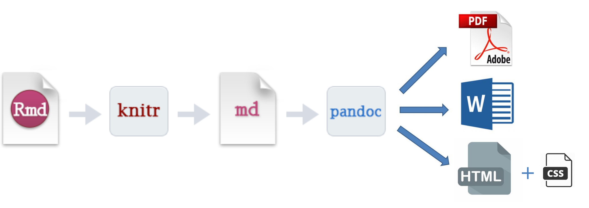
```

--

`r icon::fa("arrow-circle-right")` Impress your director with dynamic output | Turn into a geek | Expose your skills on the web 
 


---
class: inverse, center, middle

# `r icon::fa("rocket")` Launch document on the web

<html><div style='float:left'></div><hr color='#ffdd55' style="margin-top: -60px;" size=1px width=720px></html>


---

# `r icon::fa("rocket")` Launch document on the web

## Mission

Send an HTML output on Github

```{r echo=FALSE, out.width="100%"}
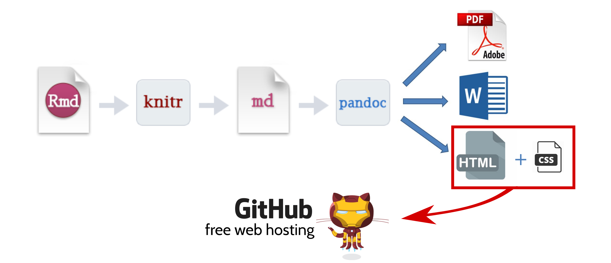
```

---

# `r icon::fa("rocket")` Launch document on the web

### 5 steps 

1. Open new GitHub repository and activate Github page
2. Link this new repo to a RStudio project
3. Add a `.Rmd` document and generate the HTML document (we know that part!)
4. Declare (`add`) and document (`commit`) the modifications on the repository
5. Send these modifications with the HTML output on Github via RStudio

--

### Let's do it together!

---

# `r icon::fa("rocket")` Launch document on the web

### 1a. Open a new GitHub repository

```{r echo=FALSE, out.width="100%"}
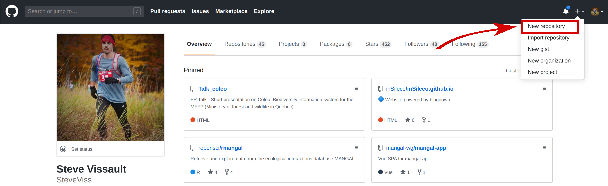
```

--

- Name it as `firstOnlineDocument`
- Let's make the repository public

---

# `r icon::fa("rocket")` Launch document on the web

### 1b. Activate Github page

```{r echo=FALSE, out.width="100%"}
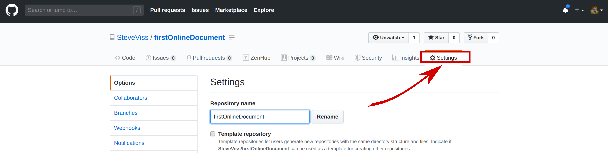
```

---

# `r icon::fa("rocket")` Launch document on the web

### 1b. Activate Github page

```{r echo=FALSE, out.width="100%"}
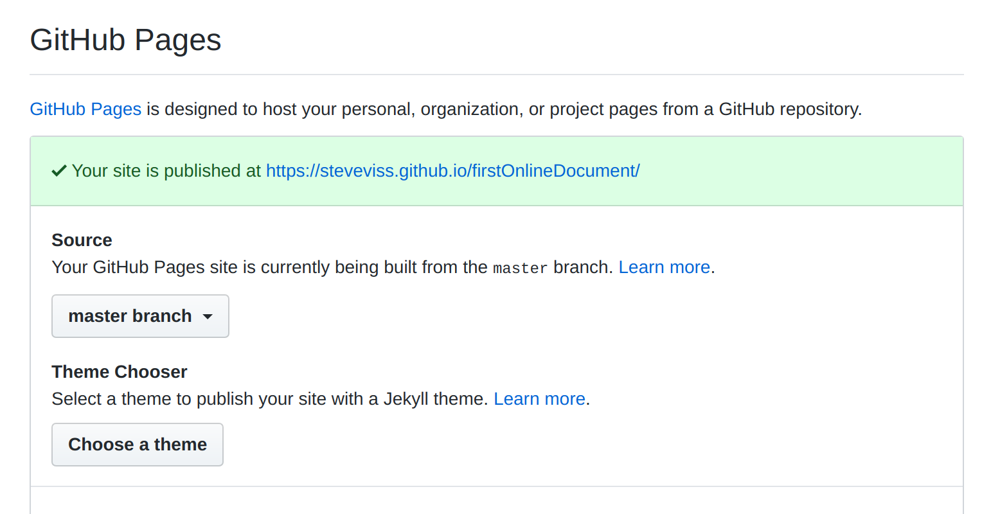
```

---

# `r icon::fa("rocket")` Launch document on the web

### 1b. Activate Github page

Several options

```{r echo=FALSE, out.width="100%"}
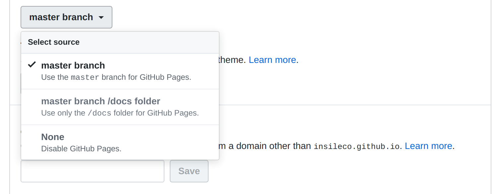
```


---

# `r icon::fa("rocket")` Launch document on the web

### 2. Link this new repo to a RStudio project

In RStudio: file > new project... > Version control > Git

```{r echo=FALSE, out.width="40%", fig.align = 'center'}
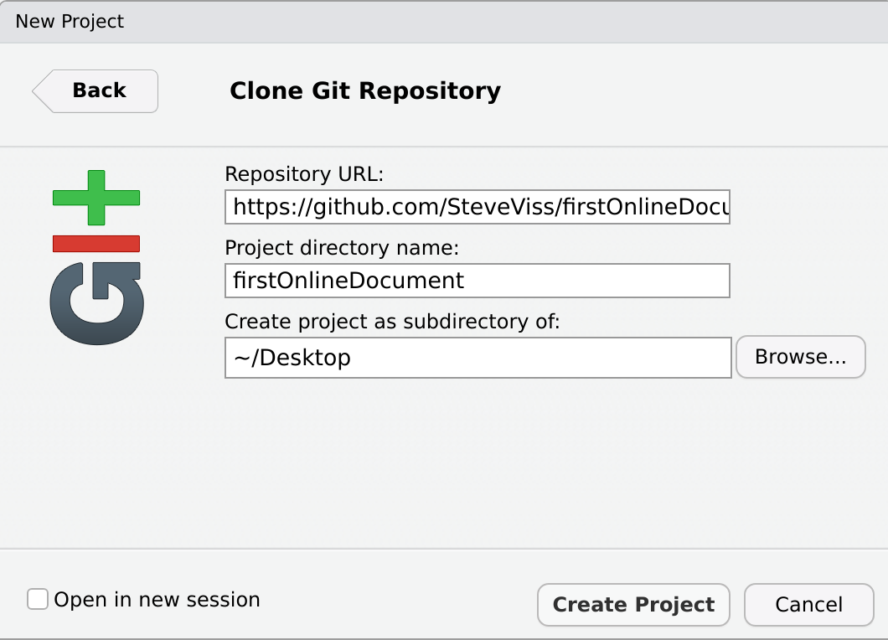
```

- Fill the field `Repository URL` with the URL address of your repo **and add `.git` at the end**
- Exemple: `https://github.com/SteveViss/firstOnlineDocument.git`


---

# `r icon::fa("rocket")` Launch document on the web

### 3. Add a `.Rmd` document and generate the HTML document 

- You know that part, so let's do it.
- We want to create a `.Rmd` and produces a `.html` file in the RStudio project folder.
- `r icon::fa("exclamation-triangle")` with the following filenames: `index.html` & `index.Rmd`
- Make sure you save the files within the project folder

```{r, echo=FALSE}
countdown::countdown(minutes = 5, seconds = 0)
```

---

# `r icon::fa("rocket")` Launch document on the web

### 4. Declare (`add`) and document (`commit`) the modifications on the repository

```{r echo=FALSE, out.width="100%", fig.align = 'center'}
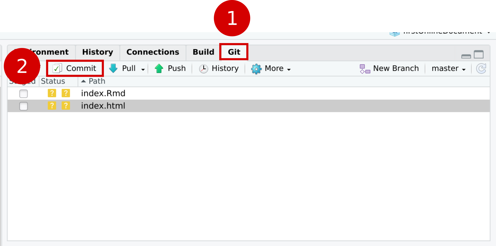
```

---

# `r icon::fa("rocket")` Launch document on the web

### 4. Declare (`add`) and document (`commit`) the modifications on the repository

```{r echo=FALSE, out.height="80%", fig.align = 'center'}
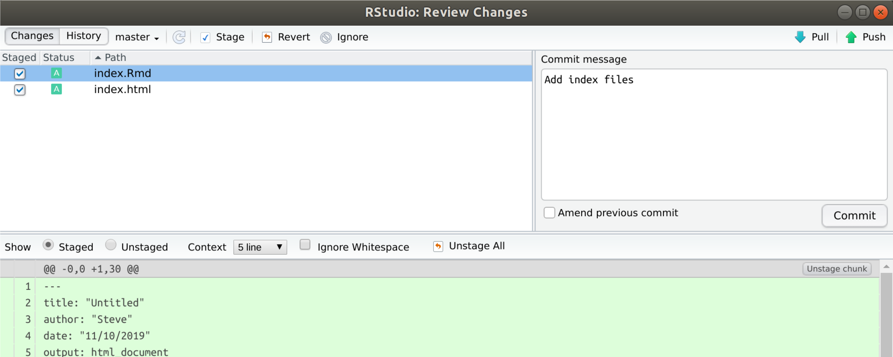
```


---

# `r icon::fa("rocket")` Launch document on the web

### 5. Last step, send these modifications on the Github repo via RStudio

```{r echo=FALSE, out.height="80%", fig.align = 'center'}
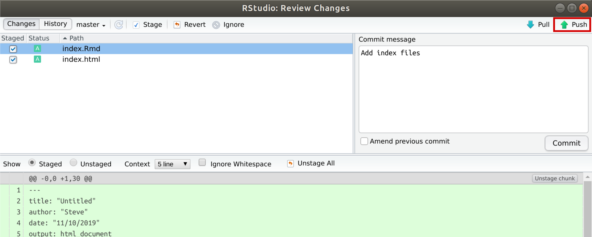
```


---

# `r icon::fa("rocket")` Launch document on the web

Wait few minutes and see the result at [https://YOURUSERNAME.github.io/firstOnlineDocument/](https://YOURUSERNAME.github.io/firstOnlineDocument/)

```{r echo=FALSE, out.width="35%", fig.align = 'center'}

```


---

# `r icon::fa("book")` The `down` universe

- Write a notebook: `bookdown`
- Write a thesis: `thesisdown`
- Write a scientific article `rticles`
- Create a poster: `posterdown`
- Create nice presentation: `xaringan` or `rmarkdown`
- Build a CV: `vitae`
- Generate a blog: `blogdown`
- Generate R package documentation: `pkgdown`

---
class: inverse, center, middle

# `r icon::fa("rocket")` Building a presentation

<html><div style='float:left'></div><hr color='#ffdd55' style="margin-top: -60px;" size=1px width=720px></html>


---

# Motivation

1. Create a presentation `r icon::fa("microphone")`
2. Use Markdown to quickly format your content
3. Insert code examples `r icon::fa("cogs")`
4. Insert your R figures `r icon::fa("chart-bar")`


---
# Create a Rmarkdown presentation

## Templates in R Studio

- [ioslides](https://bookdown.org/yihui/rmarkdown/ioslides-presentation.html)
- [slidy](https://bookdown.org/yihui/rmarkdown/slidy-presentation.html)
- also "r presentations" but it uses a different markdown syntax so we won't present it here

```{r ioslides, echo=FALSE, out.width='49%', fig.show='hold'}
knitr::include_graphics(c('assets/img/ioslides1.png', 'assets/img/ioslides2.png'), dpi = NA)
```

---
# Create a Rmarkdown presentation in R Studio

.center[
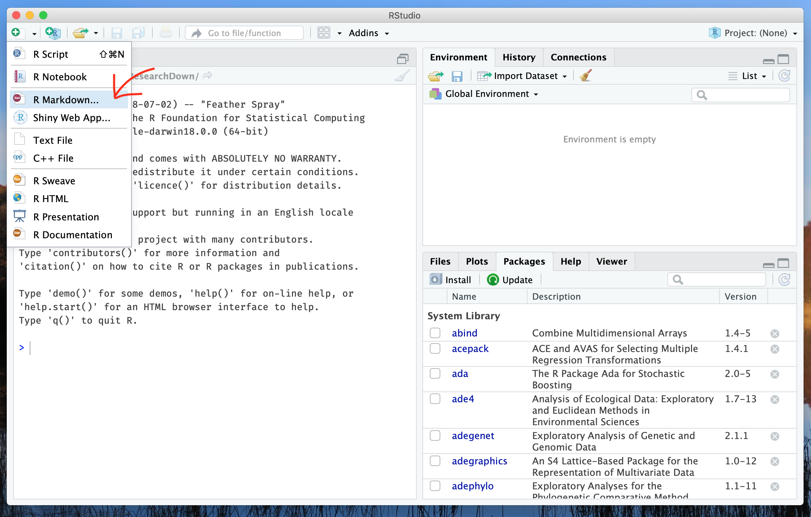
]

---
# Create a Rmarkdown presentation in R Studio

.center[
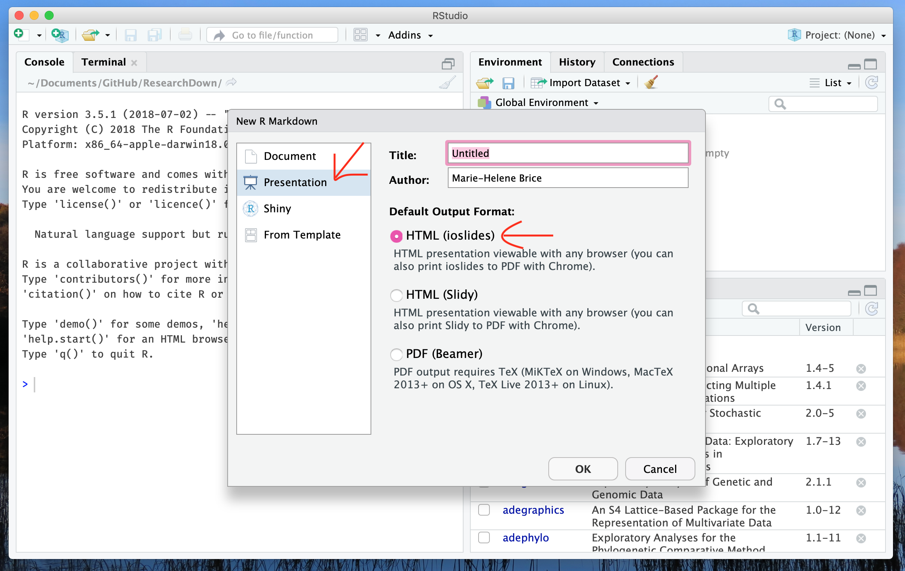
]

---
# ioslides

Specify the `ioslides_presentation` output format in the YAML metadata of your document


```md
---
title: "My beautiful ioslide presentation"
author: "John Doe"
date: '2019-10-02'
output: ioslides_presentation
---
```

---
# ioslides 

Knit 🧶 to create the HTML presentation!

.center[]


---
# ioslides

Create new slides by using `#` or `##`


```md
# Section slides | super stuff
```

.center[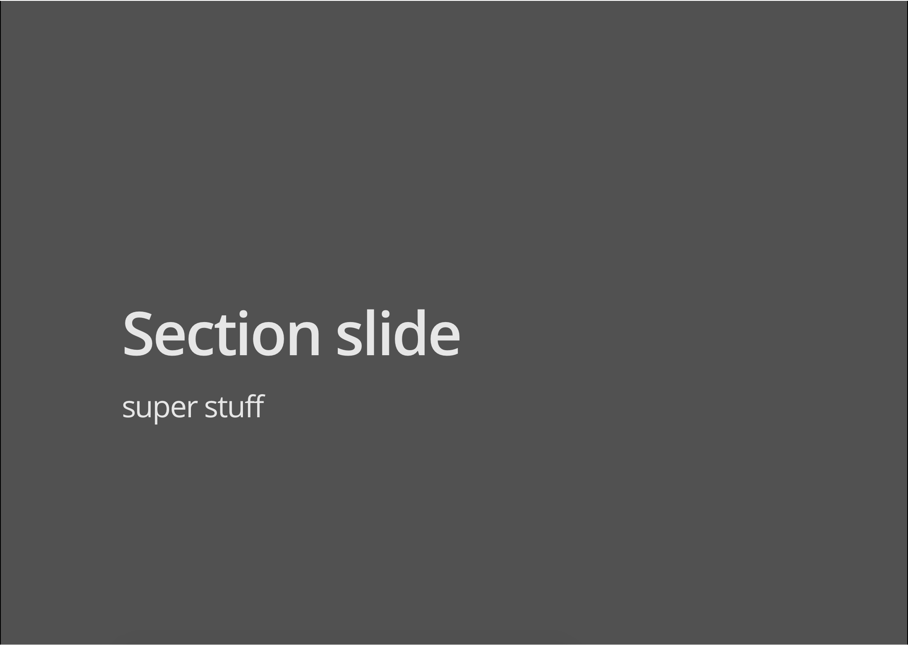]

---
# ioslides

Create new slides by using `#` or `##`

```md
# Section slide | with background image
{data-background=bg_mountain.jpg data-background-size=cover}
```

.center[

]


---
# ioslides

Create new slides by using `#` or `##`


```md
## Slides with content

- I love science
- and **kitten!**

{ width=60% }
```

.center[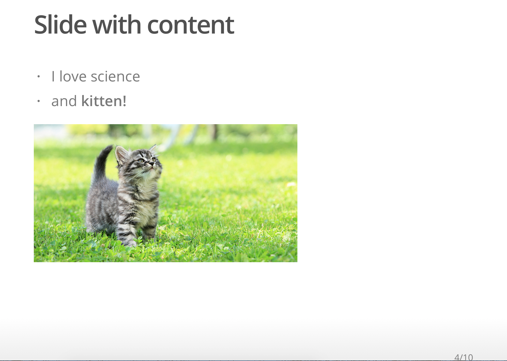]


---
# ioslides - `r icon::fa("r-project")` code


````md
## Slide with R code

```{r, echo = TRUE}`r ''`
fit <- lm(dist ~ 1 + speed, data = cars)
coef(summary(fit))
```
````

.center[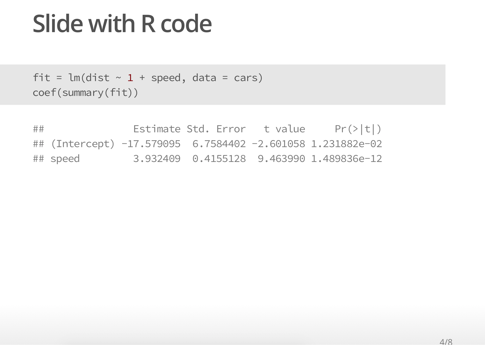]

---
# ioslides - `r icon::fa("r-project")` plot


````md
## Slide with R plot

```{r, echo = TRUE}`r ''`
plot(dist ~ speed, data = cars)
```
````

.center[
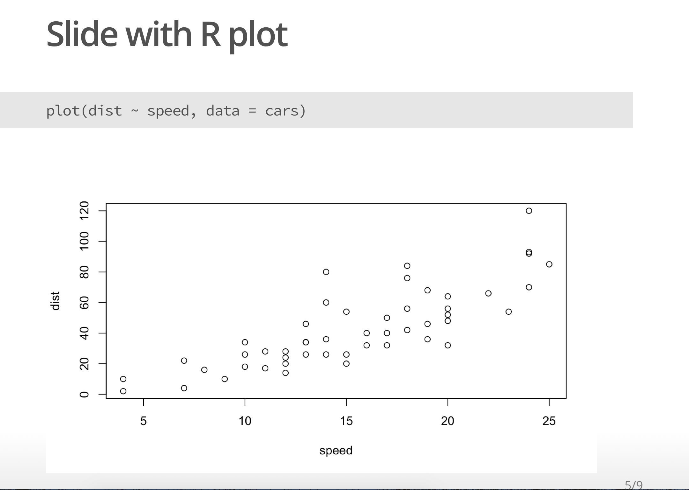
]
---
# ioslides - options


```md
---
title: "My beautiful ioslide presentation"
author: "John Doe"
date: '2019-10-02'
output:
  ioslides_presentation:
    logo: insilecoLogo.png
---
```

.center[
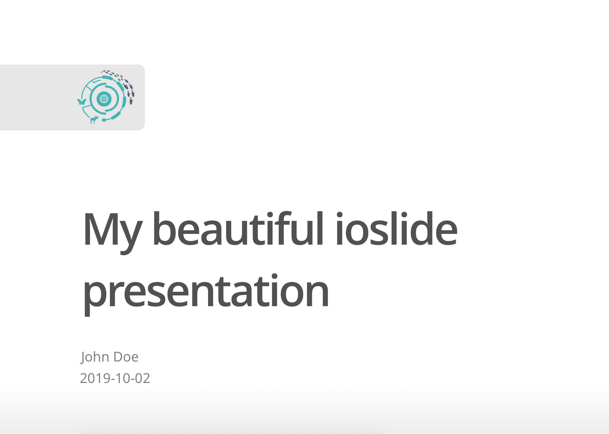
]


---
# ioslides - options

### Customize

- presentation size using `widesreen`
- speed of slide transitions using `transition`
- incremental bullets using `incremental`
- text size using `smaller`

```md
---
title: "My beautiful ioslide presentation"
author: "John Doe"
date: '2019-10-02'
output:
  ioslides_presentation:
    widescreen: true
    transition: slower
    incremental: true
    smaller: true
---
```

---
# ioslides - Customization

You can customize your presentation by adding your own CSS and your own template

```md
---
title: "My beautiful ioslide presentation"
author: "John Doe"
date: '2019-10-02'
output:
  ioslides_presentation:
    css: mystyles.css
    template: mytemplate.html
---
```

---
# Slidy

To create a [Slidy](https://bookdown.org/yihui/rmarkdown/slidy-presentation.html) presentation in R studio

.center[
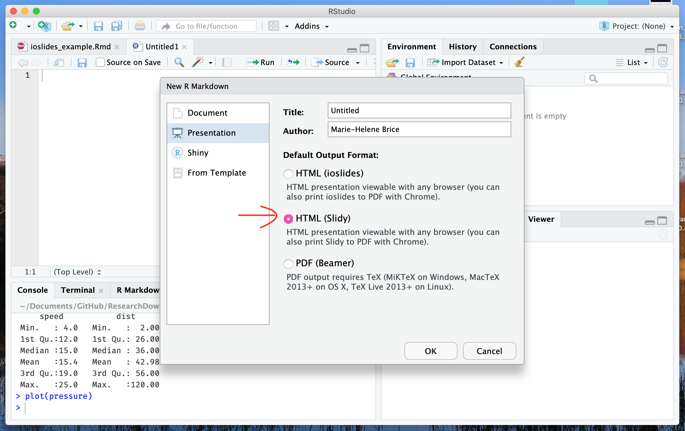
]


---
# Slidy

- You can transform your ioslides presentation to a slidy presentation by changing the output format to `slidy_presentation` in the YAML
- Usage of slidy is similar to ioslides, but see details [here](https://bookdown.org/yihui/rmarkdown/slidy-presentation.html)

```md
---
title: "My beautiful slidy presentation"
author: "John Doe"
date: '2019-10-02'
output: slidy_presentation
---
```

.center[
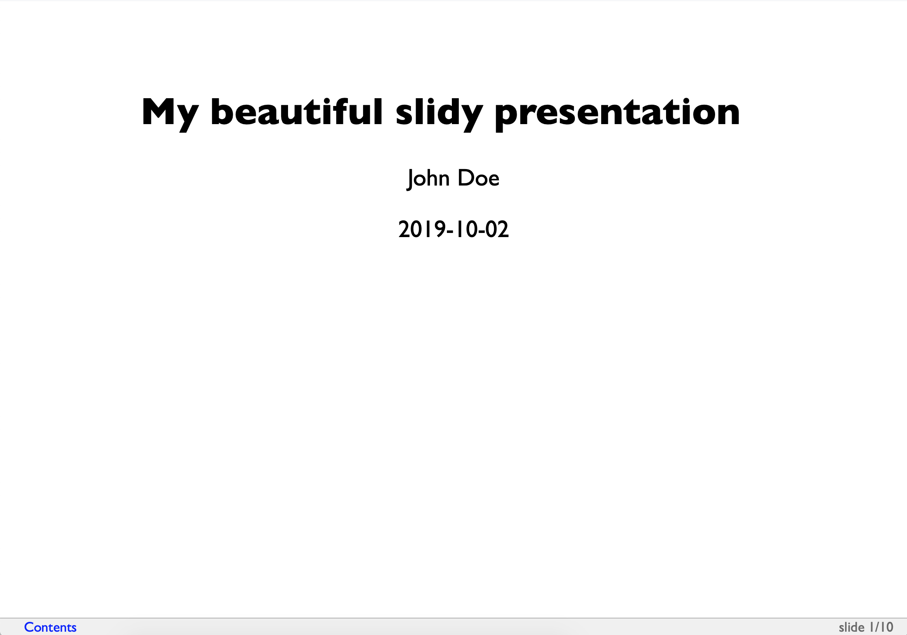
]


---
# PowerPoint

- You can also generate a [PowerPoint](https://bookdown.org/yihui/rmarkdown/powerpoint-presentation.html) presentation using R!

```md
---
title: "My beautiful PPT presentation"
author: "John Doe"
date: '2019-10-02'
output: powerpoint_presentation
---
```

---
# Xaringan

- It is also possible to install R packages to create presentation
- ex: xaringan, see [here](https://slides.yihui.name/xaringan/#1) and [here](https://bookdown.org/yihui/rmarkdown/xaringan.html)

```r
install.packages("xaringan")
```

```md
---
title: "My beautiful Xaringan presentation"
subtitle: "Symposium"
author: "John Doe"
output:
  xaringan::moon_reader:
---

# Slide 1

wow!

---
# Slide 2

The end!
```

---
# Xaringan

- QCBS R workshop presentations are built using xaringan!

.center[
[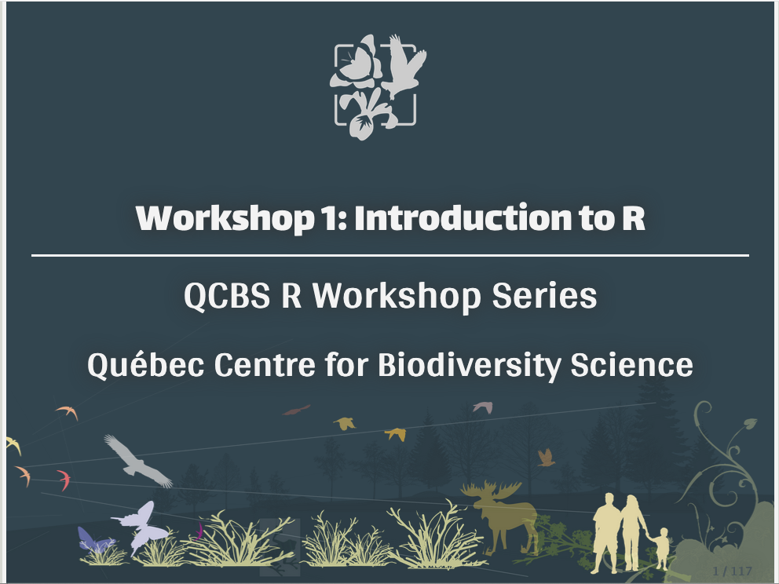](https://qcbsrworkshops.github.io/workshop01/workshop01-en/workshop01-en.html#1)
]


---

# Resources

1. [R Markdown: The Definitive Guide - Chapter 4](https://bookdown.org/yihui/rmarkdown/presentations.html)
2. [ioslides](https://kevcaz.github.io/pres_Rmarkdown_fr/#1)
3. [xaringan](https://slides.yihui.name/xaringan/#1)


---

class: inverse, center, middle

# `r icon::fa("rocket")` Create a notebook

<html><div style='float:left'></div><hr color='#ffdd55' style="margin-top: -60px;" size=1px width=720px></html>


---
# Motivation

.pull-left[
- Producing more complicated documents
- Automatic number and cross-referencing
  - Figures
  - Tables
  - Equations
  - Theorems
  - Custom headers
- Figure formatting and placement
- Customized visuals
]

.pull-right[
```{r, out.width='35%', fig.align='center', echo = F}
knitr::include_graphics('https://bookdown.org/yihui/bookdown/images/logo.png')
```
]

---

# With Rstudio project

```{r echo=FALSE, out.height="60%", fig.align = 'center'}
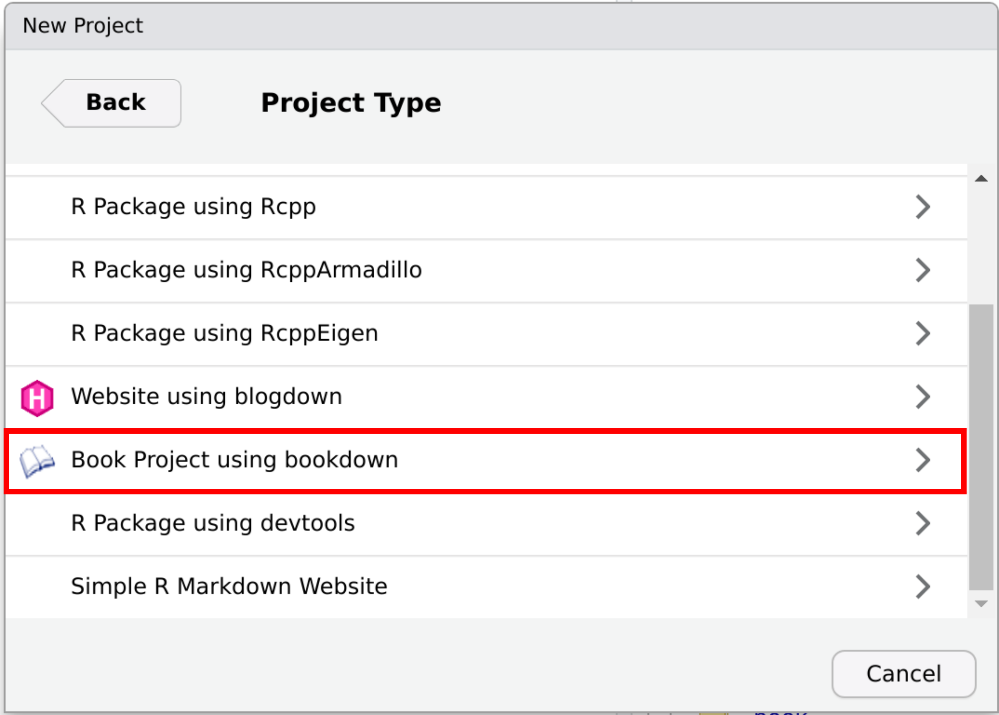
```

---

# Bookdown - Examples

- Minimal: https://bookdown.org/yihui/bookdown-demo/

<iframe width="100%" height="80%"
src="https://bookdown.org/yihui/bookdown-demo/">
</iframe>

---

# Bookdown - Examples

- Tufte style: https://bookdown.org/yihui/bookdown-demo3/

<iframe width="100%" height="80%"
src="https://bookdown.org/yihui/bookdown-demo3/">
</iframe>

---

# Bookdown - Usage

- Collection of `.Rmd` files
  - Individual chapter for each file
  - Chapter title defined by first-level heading `#`
  - Usual Rmarkdown syntax
  - Rendered by filename order by default

.pull-left[
- `01-Introduction.Rmd`
<br><br><br>
- `02-Chapter1.Rmd`
<br><br><br>
- `03-Conclusion.Rmd`
]

.pull-right[
```{r, eval = F}
# Introduction
This is the introduction
```

```{r, eval = F}
# Chapter 1
This is the Chapter 1
```

```{r, eval = F}
# Conclusion
This is the conclusion
```
]

---

# Bookdown - Usage

- Outputs options
  - `HTML`
  - `pdf`
  - `E-Books`


---

# Bookdown - Getting started

<iframe width="100%" height="90%"
src="https://bookdown.org/yihui/bookdown/get-started.html">
</iframe>

---

# Bookdown - Resources

- Github repository: https://github.com/rstudio/bookdown
- Bookdown book: https://bookdown.org/yihui/bookdown/


---

# `r icon::fa("book")` The `down` universe

- Write a notebook: `bookdown`
- Write a thesis: `thesisdown`
- Write a scientific article `rticles`
- Create a poster: `posterdown`
- Create nice presentation: `xaringan` or `rmarkdown`
- Build a CV: `vitae`
- Generate a blog: `blogdown`
- Generate R package documentation: `pkgdown`
